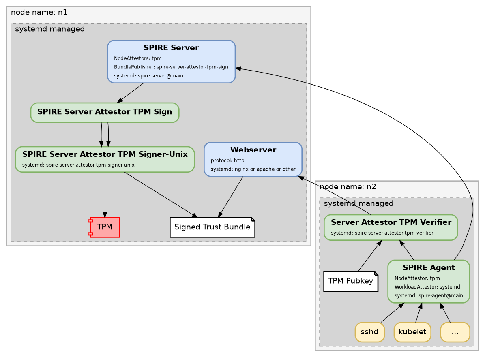

# SPIRE Server Attestor TPM

[](https://opensource.org/licenses/Apache-2.0)
[](https://github.com/spiffe/spiffe/blob/main/MATURITY.md#development)

This project enables SPIRE Agents to automatically attest the SPIRE server(s) via a trusted set of [TPMs](https://en.wikipedia.org/wiki/Trusted_Platform_Module).

This enables a large number of Workload nodes to easily establish trust during initial setup, or reestablish trust if they are powered down too long or if the server is broken too long without needing to touch the nodes.

It can also be used along with the spire-ha-agent to build an even higher level of HA trust domain.

## Warning

This code is very early in development and is very experimental. Please do not use it in production yet. Please do consider testing it out, provide feedback, and maybe provide fixes.

## Server Attestation

When bootstrapping a SPIRE Agent to a SPIRE Server, proof that the Server is the correct one to trust must be established. Also, when trust is lost and must be reestablished, this procedure must be performed again. Server Attestation extends the built in support in SPIRE to allow fully automated bootstrapping/rebootstrapping in a plugable way.

This component implements this interface utilizing TPMs to attest the validity of the SPIRE Server to the SPIRE Agents. This enables fully hands off trust (re)establishment without 3rd parties. That is very important in setups where SPIRE is your bottom turtle of trust.

## Minimal Architectural Diagram

There are multiple ways of setting this up. The simplest is diagrammed here:


## Components

* spire-server-attestor-tpm-sign - spire-server plugin
* spire-server-attestor-tpm-signer-unix - service
* spire-server-attestor-tpm-signer-http - service (optional)
* spire-server-attestor-tpm-verifier - spire-agent service

### spire-server-attestor-tpm-sign

SPIRE Server Bundle Publisher plugin. Recieves a bundle from the SPIRE Server. Signs it locally using the spire-server-attestor-tpm-signer-unix service, and optionally through a list of remote spire-server-attestor-tpm-signer-http services.  Even if the trust bundle hasn't updated, it will still push out new versions as their signatures get close to expiry.

### spire-server-attestor-tpm-signer-unix

Runs as root, has access to the TPM, listens for signing requests on a unix socket.

This allows other services to request trust bundles be signed by the TPM.

Stores the signed trust bundle in a configurable location for serving out to agents via http server (nginx, apache, etc).

Protect the unix socket.

### spire-server-attestor-tpm-signer-http

Listens on the network for trust bundle signing requests. Runs as non root. Accepts a trust bundle that must be already signed by an approved key. Forwards the request to the spire-server-attestor-tpm-signer-unix socket. An ip based filter can also be applied to block traffic so the service doesn't spend extra time decoding/key checking. Adds an additional signature for more trust.

### spire-server-attestor-tpm-verifier

Runs on each SPIRE Agent node. Provides a unix socket for it to fetch a trust bundle from for attesting the SPIRE Server. You configure the verifier with the HTTP URL to retrieve the signed trust bundle from, along with the TPM keys. It will verify the validity of the trust bundle, then return it to the SPIRE Agent if valid.

## Prepare your TPMS

There is a minimum number of 1 TPM for setting up a system. For a standard SPIRE server setup, we recommend at minimum 2 TPMS. One primary, and one offline backup TPM.

For a spire-ha-agent based setup, we recommend a minimum number of 3 TPMs. 1 for each side of the HA trust domain, and one offline backup TPM.

Backup TPMs can be used in place of a primary one, should the node/TPM fail and needs replacing in a timely manner.


## Setup

### Check that you don't have a key pair already on the TPM
```
tpm2_getcap handles-persistent | grep 0x81008006
```

### If you don't have a key, do the following to generate the key pair
```
tpm2_create -G rsa2048:rsassa:null -g sha256 -u key.pub -r key.priv -C 0x81000001
tpm2_load -C 0x81000001 -u key.pub -r key.priv -c key.ctx
tpm2_evictcontrol -C o -c key.ctx 0x81008006
```

``` Generate the public key file to copy to the other hosts
tpm2_readpublic -c 0x81008006 -o pub.pem -f pem  -o <main.pem,backup.pem,a.pem,b.pem,etc here>
```

### Distribute the public keys to:
```
/etc/spire/server-attestor-tpm/keys/
```

## Configuration

### spire-server

Example server.conf snippet:
```
    BundlePublisher "signer" {
        plugin_cmd = "/usr/bin/spire-server-attestor-tpm-sign"
        plugin_data {
            # Additional URL's in which to use for signatures
            urls = ["http://1.2.3.4:8181/sign"]

            # Defaults
            # socket = "/var/run/spire/server-attestor-tpm/signer-unix.sock"
            # frequency = "5m"
        }
    }
```

### signer-unix

Example signer-unix.conf
```
socket: /var/run/spire/server-attestor-tpm/signer-unix.sock
tpm-address: 0x81008006
duration:  10m
dir: /usr/share/nginx/html

# filename: "spiffetrustbundle.token"
# tmpfile: "spiffetrustbundle.token.tmp"

# Issuer can be set. Defaults to the hostname of the machine its running on.
# issuer: xxxx
```

### signer-http

Example signer-http.conf:
```
# Location of the signer-unix service socket
socket: /var/run/spire/server-attestor-tpm/signer-unix.sock

# Directory where keys will be looked up in. If relative, it will be relative to the location of this config file.
keydir: keys

# Key to verify signatures against.
primary: a.pem

# Backup key to allow for signatures. If seen, it will be logged.
backup: c.pem

# Port and optional ip address to listen on
listen-addr: ":8181"

# Alowed ip addresses allowed to talk to the service. Used to prevent random nodes from causing too much cpu load verifying certs. Signed certs are still required for proper auth.
allowed-addrs:
- 127.0.0.1
- spire-server.${SPIFFE_TRUST_DOMAIN}
# - spire-server-a.${SPIFFE_TRUST_DOMAIN}
# - spire-server-b.${SPIFFE_TRUST_DOMAIN}
```

### Verifier

#### Standalone SPIRE Server

Example verifier.conf
```
keydir: keys
socket: /var/run/spire/server-attestor-tpm/verifier.sock
keyset:
  main:
    url: http://1.2.3.4/spiffetrustbundle.token
    backup: backup.pem
    chain:
    - primary.pem
```

Then, in your spire agent.conf, in the agent section:
```
trust_bundle_url = "http://localhost/trustbundle?instance=main"
trust_bundle_unix_socket = "/var/run/spire/server-attestor-tpm/verifier.sock"
```

#### SPIRE-HA-Agent setup

Example verifier.conf
```
keydir: keys
socket: /var/run/spire/server-attestor-tpm/verifier.sock
keyset:
  a:
    url: http://1.2.3.5/spiffetrustbundle.token
    backup: backup.pem
    chain:
    - a.pem
    - b.pem
  b:
    url: http://1.2.3.6/spiffetrustbundle.token
    backup: backup.pem
    chain:
    - b.pem
    - a.pem
```

Then, in your spire agent.conf for side a, in the agent section:
```
trust_bundle_url = "http://localhost/trustbundle?instance=a"
trust_bundle_unix_socket = "/var/run/spire/server-attestor-tpm/verifier.sock"
```

And in your spire agent.conf for side b, in the agent section:
```
trust_bundle_url = "unix:///var/run/spire/server-attestor-tpm/verifier.sock?instance=b"
trust_bundle_unix_socket = "/var/run/spire/server-attestor-tpm/verifier.sock"
```
